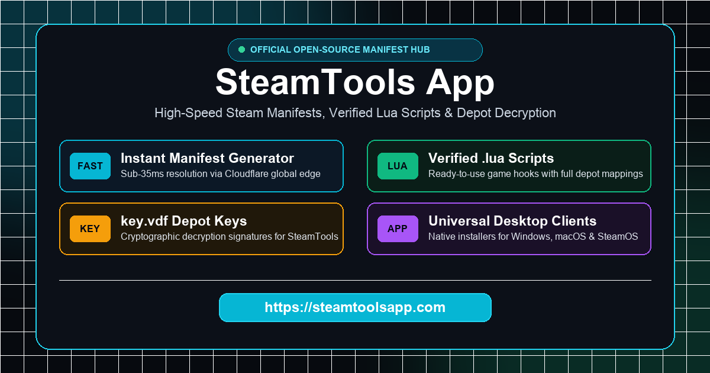

<div align="center">



# ⚡ ManifestHub by ManiLuaHub

**为 [ManiLuaHub.com](https://maniluahub.com) 提供底层支持的开源 Steam 清单与 Lua 脚本数据中心。**

[](https://maniluahub.com/zh)
[](https://maniluahub.com/zh/explore)
[](https://maniluahub.com/zh/docs)
[](https://maniluahub.com/zh/download)
[](LICENSE)

<p align="center">
  <a href="https://maniluahub.com/zh">🌐 <b>网页端 (Web Explorer)</b></a> •
  <a href="https://maniluahub.com/zh/explore">🎮 62k 游戏清单索引</a> •
  <a href="https://maniluahub.com/zh/docs">🔌 OpenAPI 接口</a> •
  <a href="https://maniluahub.com/zh/how-to-use">📖 使用教程</a> •
  <a href="https://maniluahub.com/zh/download">💻 客户端中心</a> •
  <a href="https://maniluahub.com/zh/faq">❓ 常见问题</a>
</p>

<p align="center">
  <a href="README.md">English</a> • <b>简体中文</b>
</p>

</div>

---

> [!TIP]
> ### ⚡ 不需要克隆 6 万多个 Git 分支！使用官方 Web 探索器秒级下载
> 
> 查验与下载游戏清单无需通过 Git 本地拉取庞大分支。直接访问 **[ManiLuaHub.com](https://maniluahub.com/zh)**：
> 
> 👉 **[立即访问 ManiLuaHub.com (进入网页端)](https://maniluahub.com/zh)**
> 
> - 🔍 **瞬时搜索**：支持游戏中文名、英文名及 Steam AppID 极速检索（如《黑神话：悟空》`2358720`、《赛博朋克2077》`1091500`）。
> - 👁️ **透明代码审计**：在线查看语法高亮的 Lua 清单蓝图与 Depot 解密密钥树。
> - 📦 **一键打包**：直接下载免配置的 `<AppID>.lua` 与 `key.vdf` ZIP 压缩包，解压即用。
> - 🔌 **免费 OpenAPI**：为机器人、社区工具及自动化脚本提供毫秒级 JSON 接口。

---

## 📖 项目简介

**ManifestHub** 是由 **ManiLuaHub** 维护的分布式开源 Steam 清单索引仓库，收录全网超 **62,257+ 款 Steam 游戏与 DLC** 的标准清单配置与 Lua 入库脚本。

- **Branch-per-AppID 分支架构**：每个收录的 Steam 游戏分配独立 Git 分支（例如 `origin/730` 对应 CS2，`origin/2358720` 对应黑神话悟空），支持轻量按需检索。
- **纯文本安全审计**：仅收录只读 `<AppID>.lua` 指令脚本与 `key.vdf` Valve 标准密钥描述文件，**绝对不包含任何二进制可执行文件或第三方注入器**，安全透明。
- **通用客户端兼容**：原生兼容 **Watt Toolkit (Steam++)**、**SteamTools**、**GreenLuma**、**SmokeAPI**、**Koaloader**、**SteamOS (Steam Deck)** 及 macOS **Whisky / CrossOver**。

---

## 🛠️ 架构与数据流

```text
       ManiLuaHub.com Web App & OpenAPI Gateway (Cloudflare Edge)
                                 │
                ┌────────────────┴────────────────┐
                ▼                                 ▼
    1. Multi-Tier Cache Layer             2. Raw Manifest Stream
     - Cloudflare Edge Cache (HIT)         github.com/manilua-hub/ManifestHub3
     - Cloudflare D1 Database              (62,257+ AppID Isolated Branches)
                │                                 │
                └────────────────┬────────────────┘
                                 ▼
                     Verified Manifest Package
                      ├── <AppID>_public.lua
                      ├── key.vdf (DepotKey AES-256)
                      └── README.txt
```

---

## ⚡ 核心特性

- 🔍 **Live Code Inspector** — 在线语法高亮审查 Lua 蓝图代码，杜绝未知风险。
- 🌳 **Depot Key Tree** — 可视化浏览分卷 ID、GID 与对应 AES-256 解密密钥。
- 🌐 **Sub-35ms Edge Resolution** — 全球 Anycast 边缘网络加速，高频资源毫秒级响应。
- 🛡️ **Cryptographic Integrity** — 所有清单均校验公开 SHA-256 哈希完整性。
- 🔓 **Free & Keyless REST API** — 免密钥、无限制的开放式 OpenAPI 端点。

---

## 🚀 3 步快速上手

1. 打开 **[ManiLuaHub.com](https://maniluahub.com/zh)**。
2. 搜索游戏名称（如 *泰拉瑞亚* 或 *Elden Ring*）或数字 AppID（如 `1245620`）。
3. 点击 **Download ZIP Bundle**，将解压出的 `.lua` 与 `key.vdf` 放入对应的工具目录（如 Watt Toolkit 清单目录），启动 Steam 即可。

---

## 🔌 开放接口 (OpenAPI 3.0)

开发者可直接调用 ManiLuaHub 的开放 API 构建第三方工具或社区机器人：

### 1. 查询游戏元数据与清单状态
```bash
curl -s "https://maniluahub.com/api/v1/manifest/2358720" | jq .
```

### 2. 流式获取纯净 Lua 蓝图脚本
```bash
curl -s "https://maniluahub.com/api/files/2358720/lua" -o 2358720.lua
```

### 3. 获取 key.vdf 密钥文件
```bash
curl -s "https://maniluahub.com/api/files/2358720/key" -o key.vdf
```

### 4. 一键下载完整 ZIP 压缩包
```bash
curl -s -O -J "https://maniluahub.com/api/files/2358720/zip"
```

完整交互式 OpenAPI Swagger 文档请参阅：**[maniluahub.com/zh/docs](https://maniluahub.com/zh/docs)**。

---

## 🤝 参与贡献

欢迎社区共同维护庞大的 Steam 清单数据库：

- **提交新游戏 AppID 需求** → [GitHub Issues](https://github.com/manilua-hub/ManifestHub3/issues)
- **反馈清单失效或密钥变动** → [提交反馈 Issue](https://github.com/manilua-hub/ManifestHub3/issues)
- **提交 Pull Request** → 欢迎基于 AppID 命名分支提交更新。

---

## 📄 开源协议与免责声明

- **开源协议**：本项目代码与开源数据集采用 [MIT License](LICENSE) 授权。
- **免责声明**：Steam、SteamOS 及 Steam 徽标是 Valve Corporation 的注册商标。ManiLuaHub 为独立的非盈利开源社区项目，与 Valve Corporation 概无关联。

---

<div align="center">

Made with ❤️ for the global gaming community • **[ManiLuaHub.com](https://maniluahub.com/zh)**

</div>
